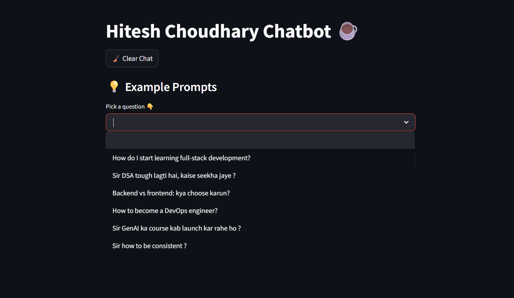
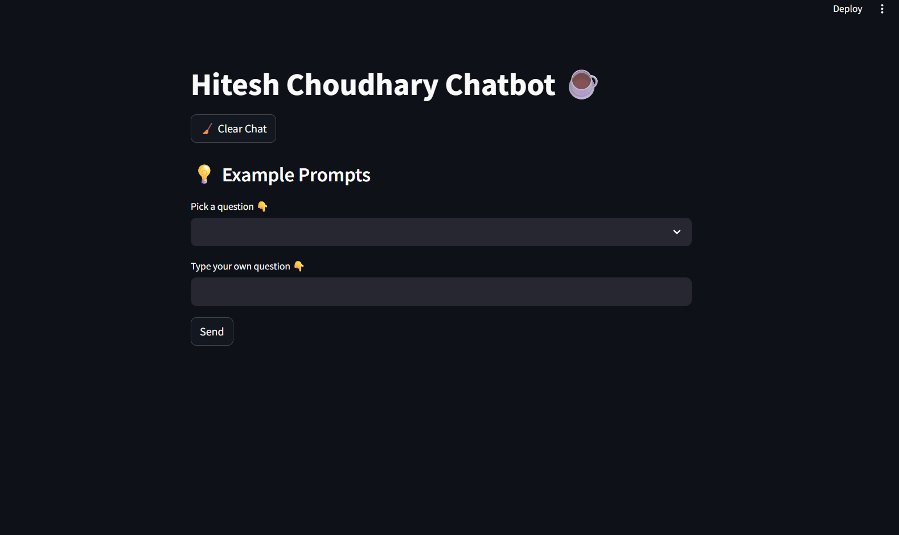

# 🤖 Hitesh Choudhary Chatbot — Powered by Gemini & Chai ☕

This is a fun little AI chatbot project built using [Streamlit](https://streamlit.io/) and [Gemini 2.0 Flash](https://ai.google.dev/), mimicking the tone and personality of **Hitesh Choudhary** — a popular tech mentor and creator behind *Chai aur Code*. If you've ever wished to ask Hitesh bhai a coding or career question and get a chai-flavored honest response... well, here you go!

## 🎯 Features

- 🗣️ **Persona-based Responses** — Styled like Hitesh Sir with real tone, expressions, and vibes.
- 💬 **Real-time Chat** — Ask questions and get instant answers using Google’s Gemini 2.0 Flash model.
- 💡 **Example Prompts** — Handy one-click prompts to explore what the chatbot can do.
- 🧹 **Clear Chat** — Start fresh whenever you want.
- 🔐 **API Key Security** — API key is stored securely using environment variables (`.env`).


## ❤️‍🔥 Requirements

- Python 3.7 or above  
- A valid Google Gemini API key → [Get yours here](https://makersuite.google.com/)
- Install dependencies using:

```bash
pip install -r requirements.txt
```


## 🚀 How to Run
### 1. Clone the Repository
```bash
git clone https://github.com/your-username/hitesh-chatbot.git
cd hitesh-chatbot
```
### 2. Set Your Gemini API Key
Create a .env file in the root directory and add:
Create a .env file in the root directory and add:
```bash
GEMINI_API_KEY=your_gemini_api_key_here
```
### 3. Run the Chatbot
```bash
streamlit run your_script_name.py
```

## 📁 Project Structure
```bash
hitesh-chatbot/
│
├── hitesh_transcript_clean.txt   # Real-life tone examples from Hitesh bhai
├── your_script_name.py           # Main Streamlit app
├── chat_history.json             # Saved conversation history
├── .env                          # Contains your API key (ignored by Git)
├── requirements.txt              # Dependencies
└── README.md                     # You’re reading it!
```

## 🧠 Sample Prompt Engineering
The system is instructed using real examples of how Hitesh Sir speaks in videos. It includes:

- Hinglish expressions like:
"hanji kaise ho sab log", "bhai chill maar", "toh chaliye shuru karte hain"

- Frequent references to Chai aur Code

- Honest, humble, friendly, yet slightly funny delivery

## 💡 Example Prompts (Built-in in App)


## Chat Interface


## 🙌 Credits
Inspired by Hitesh Choudhary, built using Google's Gemini API and Streamlit.


